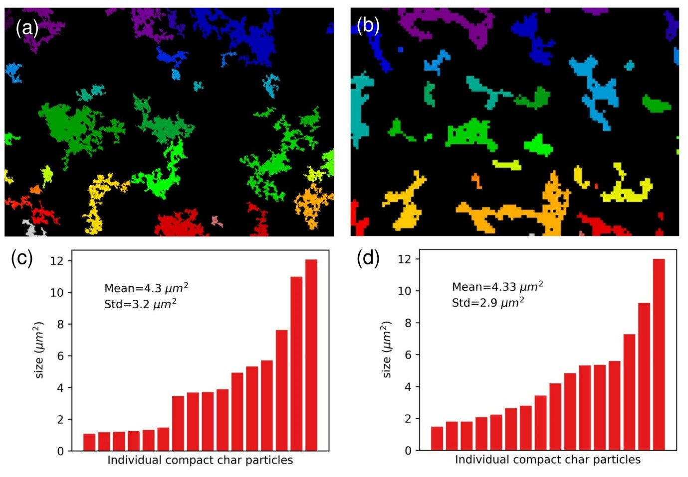

# Image-Processing-Tools

## About the project

This repository includes some image processing tools. The *segmentation.py* can be used to label conneted areas in a image, and also quantify individual area, and generate a size distribution. 

## Examples

 Size distribution comparison of numerical generated image and testing image.

  

